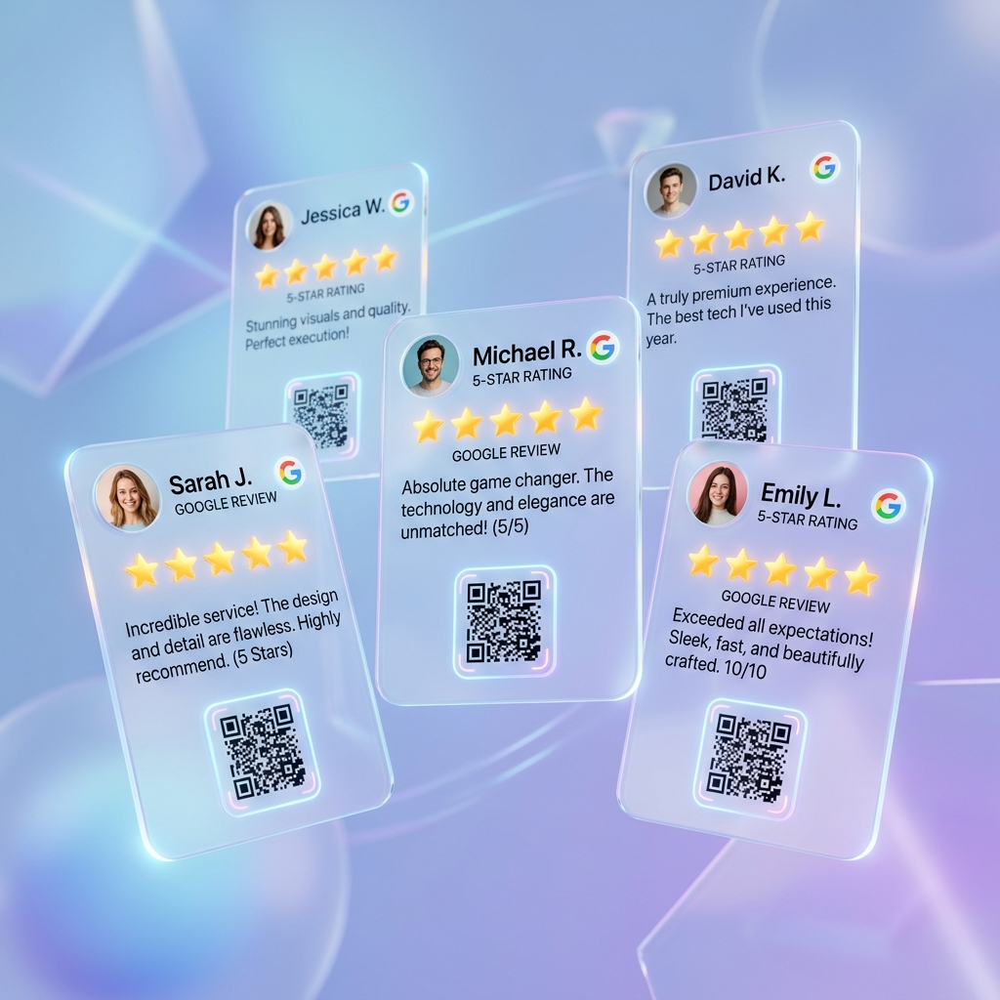

<div align="center">
  

  # ReviewGlide ⚡
  ### Frictionless Google Reviews & QR Studio for Local Businesses

  [](https://reviewglide.vercel.app)
  [](LICENSE)
  [](#design-aesthetics)
  [](#architecture)

</div>

---

## 📖 Overview

**ReviewGlide** is an ultra-polished, Apple-inspired web platform designed for physical storefronts, studios, and local businesses to maximize their 5-star Google Reviews. 

By replacing clunky link sharing with frictionless QR scans, intelligent sentiment tag builders, and instant clipboard redirection, ReviewGlide turns satisfied customers into vocal brand advocates in under 10 seconds.

---

## 🌟 Key Features

- 🍎 **Apple-Inspired Glassmorphic UI**: High-end translucent cards, soft ambient background glows, responsive spring micro-animations, and fluid physics.
- ⚡ **Smart Dynamic Review Builder**: Customers tap contextual highlight pills (*⚡ Fast & Friendly*, *⭐ Top Quality*, * Business Professional*) to generate authentic review copy dynamically.
- 📲 **Interactive Live QR Code Studio**: Built-in interactive studio modal allowing business managers to enter custom identifiers, preview styled QR codes live, and download high-resolution PNGs.
- 🔄 **Python Background Sync Engine**: Automated CLI script (`scripts/generate_qrs.py`) that monitors database changes and synchronizes high-res QR codes automatically.
- 🌓 **Dynamic Dark / Light Mode**: Seamless theme toggling with smooth transitions and persistent system preferences.
- 🚀 **Zero Dependencies**: Pure Vanilla HTML5, CSS3 Custom Properties, and ES6 Javascript modules for lightning-fast performance and zero layout shifts.

---

## 📐 Architecture & Folder Structure

```text
ReviewGlide/
├── public/
│   ├── assets/
│   │   ├── apple-touch-icon.svg   # Apple home screen icon
│   │   ├── hero-banner.png        # Studio promotional graphic
│   │   └── og-image.png           # Social preview card
│   ├── data/
│   │   ├── businesses.json        # Primary JSON database
│   │   └── sync_state.json        # Auto-generated sync state
│   ├── qr-codes/                  # Auto-generated QR code assets
│   │   ├── avishkar-photos-qr.png
│   │   ├── kumar-digital-photo-studio-qr.png
│   │   └── siddhi-photos-qr.png
│   └── favicon.svg                # Vector SVG site icon
├── src/
│   ├── css/
│   │   └── main.css               # Apple Design System & tokens
│   └── js/
│       ├── app.js                 # Primary controller & route parser
│       ├── qr-studio.js           # QR generator modal handler
│       └── review-generator.js    # Smart sentiment review engine
├── scripts/
│   └── generate_qrs.py            # Python background sync script
├── index.html                     # Core single-page web app
├── vercel.json                    # Vercel production hosting config
├── package.json                   # Project metadata & npm scripts
├── AUDIT_REPORT.md                # Full technical code audit
├── AGENT_LOG.md                   # Systematic execution log
└── README.md                      # Documentation
```

---

## 🚀 Quick Start & Local Setup

### 1. Clone Repository
```bash
git clone https://github.com/AvishkarRanjane/ReviewGlide.git
cd ReviewGlide
```

### 2. Launch Local Dev Server
```bash
npx serve .
# Open http://localhost:3000 in your browser
```

### 3. Run Background QR Synchronizer (Python)
```bash
# One-shot QR sync
python scripts/generate_qrs.py --once

# Continuous monitoring loop
python scripts/generate_qrs.py
```

---

## ⚙️ Adding a New Business Profile

1. Open `public/data/businesses.json` and append your business entry:
```json
{
  "id": "my-brand-studio",
  "name": "My Brand Studio",
  "category": "Design & Print Studio",
  "googleRating": 5.0,
  "totalReviews": 45,
  "link": "https://g.page/r/YOUR_GOOGLE_REVIEW_LINK"
}
```

2. Run the sync command to automatically generate your QR code:
```bash
python scripts/generate_qrs.py --once
```

3. Your new QR code will be instantly generated at `public/qr-codes/my-brand-studio-qr.png` linking directly to `https://reviewglide.vercel.app/?id=my-brand-studio`.

---

## 🛠️ Tech Stack

- **Frontend**: HTML5, Modern CSS (Glassmorphism, CSS Custom Variables), ES6 Javascript Modules
- **Design System**: Apple SF Pro / Inter Typography, HSL Color Palettes, Spring Easing Transitions
- **Automation**: Python 3 (`urllib`, `json`, `os`), Cross-Platform Path Resolution
- **Hosting & CI/CD**: Vercel Static Hosting with Production Edge Caching

---

## 📜 License

Distributed under the MIT License. See `LICENSE` for more information.

Developed with ❤️ by **Avishkar Ranjane**.
